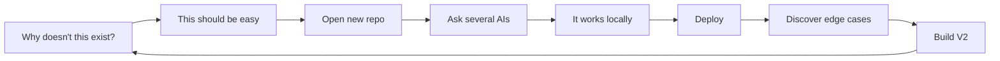

<div align="center">

# Ismail Hossain

### I turn oddly specific problems into repositories.

**AI experiments · product prototypes · research · data · travel tech · things that got out of hand**

[](https://smile-plzz.github.io/Ismail_Hossain/)
[](https://www.linkedin.com/in/md-ismail-hossain-2938541b1/)


</div>

---

```text
$ whoami
CS grad + PMIT student in Dhaka.

$ what-do-you-do
I find a problem, overthink it, build a prototype, deploy it,
then discover the problem was actually three problems wearing a trench coat.

$ coding-style
vision → AI agents → questionable confidence → localhost → production

$ current_status
probably opening another repo
```

My code runs on intuition and crashes on reality.

Most of this profile is a public lab notebook: **AI systems, agent experiments, research tooling, data projects, product ideas and useful little applications** that began with some version of *"wait, why doesn't this exist?"*

I build quickly, use AI aggressively, test things in public, and keep the interesting failures around. If you're looking for a perfectly manicured GitHub garden, you have unfortunately entered the workshop.

---

## 🛰️ Currently transmitting

*The projects closest to the front of my brain right now.*

| | Project | The idea |
|---|---|---|
| 🌊 | [**HaorBoard**](https://github.com/smile-plzz/HaorBoard) | What if booking a Bangladesh houseboat didn't require hunting through Facebook pages and phone calls? A multi-operator discovery + booking marketplace for the haor ecosystem. |
| 🚢 | [**Nautilus**](https://github.com/smile-plzz/Nautilus) | The single-operator counterpart: a proper digital home for one houseboat — story, credibility, packages, rooms, reviews and booking. |
| 👨‍👩‍👧 | [**BelaJourneys**](https://github.com/smile-plzz/BelaJourneys) | Travel designed as a gift to your parents. Find a comfortable trip; they get the experience, you handle the logistics. |
| 🎧 | [**LyricFloat**](https://github.com/smile-plzz/LyricFloat) | A lightweight Windows lyrics overlay because apparently I needed Spotify-style floating lyrics badly enough to build them. |
| 🧳 | [**wayfare**](https://github.com/smile-plzz/wayfare) | Another attempt at making travel discovery and planning feel less like spreadsheet administration. |
| 🧠 | [**spotify-intelligence-v1**](https://github.com/smile-plzz/spotify-intelligence-v1) | Spotify history → actual listening intelligence instead of waiting twelve months for Wrapped to tell you what you already knew. |
| 🤖 | [**hermes-journal**](https://github.com/smile-plzz/hermes-journal) | The public journal/log layer of my Hermes agent-infrastructure experiments. |
| 💬 | [**BetweenUs**](https://github.com/smile-plzz/BetweenUs) | An experiment currently occupying the highly scientific phase known as *"let's see where this goes."* |

---

## 🧪 The research rabbit hole

At some point, *using AI to write code* turned into *researching whether AI-written code can explain itself*.

That escalation produced the **TCRA** framework — **Transparency, Controllability, Reliability & Auditability** — and a small ecosystem of tools around evaluating AI-generated software.

| Project | Experiment |
|---|---|
| [**TCRA Code Auditor V4**](https://github.com/smile-plzz/TCRA-Code-Auditor-V4) | Cross-provider AI-code auditing and benchmarking. The fourth iteration, because apparently three auditors were insufficient. [V3](https://github.com/smile-plzz/TCRA-Code-Auditor-V3) · [V2](https://github.com/smile-plzz/TCRA-Code-Auditor-V2) · [V1](https://github.com/smile-plzz/TCRA-Code-Auditor) |
| [**TCRA Code Evaluation Interface**](https://github.com/smile-plzz/TCRA-Code-Evaluation-Interface) | Human/evaluator-facing interface for the TCRA workflow. |
| [**VibeBench Forensic Analysis Viewer**](https://github.com/smile-plzz/VibeBench-Forensic-Analysis-Viewer) | Inspecting benchmark evidence for AI-generated code like it committed a crime. |
| [**HiveMind V4 / V3**](https://github.com/smile-plzz/HiveMind_V4) | Multi-agent systems. The swarm intelligence is aspirational; the version numbers are very real. |
| [**Brainstorm.AI V1**](https://github.com/smile-plzz/Brainstorm.AI-V1) | Put several specialist AI personas in a room and make them argue productively. |
| [**Bangladesh Constitution RAG**](https://github.com/smile-plzz/-Bangladesh-Constitution-RAG-System) | Retrieval-augmented querying over the Constitution of Bangladesh. |
| [**Agent Development Framework**](https://github.com/smile-plzz/Agent-Development-Framework-An-Interactive-Guide) | Interactive guide built while I was deep enough into agents to start documenting the rabbit hole. |
| [**L2 Writing AI Sandbox**](https://github.com/smile-plzz/L2-Writing-AI-Sandbox) | AI-assisted second-language writing analysis experiments. |

> **Research loop:** ask AI to code → distrust the code → build AI to audit the AI → research the auditor → somehow graduate.

---

## 🎬 I could have just watched the movie

Instead, I repeatedly built software around watching movies.

[**NowShowing**](https://github.com/smile-plzz/NowShowing) · [**NowShowing Stream**](https://github.com/smile-plzz/NowShowing-Stream) · [**Stream V2**](https://github.com/smile-plzz/NowShowing-Stream-V2) · [**WatchMatch**](https://github.com/smile-plzz/WatchMatch) · [**OmniStream-TV**](https://github.com/smile-plzz/OmniStream-TV) · [**Obsidex**](https://github.com/smile-plzz/Obsidex) · [**anicult**](https://github.com/smile-plzz/anicult) · [**CineGemini Stream**](https://github.com/smile-plzz/CineGemini-Stream) · [**Westeros Chronicles**](https://github.com/smile-plzz/Westeros-Chronicles-Interactive-Timeline)

Movie discovery, IPTV, anime, recommendations, streaming interfaces, and an unnecessarily detailed Game of Thrones timeline all live here.

**Estimated time saved by these projects:** negative.

---

## 💊 The medication-app cinematic universe

One medication tool would have been reasonable.

I made several.

| Project | Evolution |
|---|---|
| [**Med-Tech**](https://github.com/smile-plzz/Med-Tech) | Doctor consultation + OCR prescription digitization. |
| [**PillPal**](https://github.com/smile-plzz/PillPal) | Medication tracking and reminders. |
| [**Medicine Tracker**](https://github.com/smile-plzz/medicine-tracker) | Medication tracking, again, but differently. |
| [**Medicine Impact**](https://github.com/smile-plzz/Medicine-Impact) | Visualizing what medication is doing over time. |
| [**PhysioTrace**](https://github.com/smile-plzz/PhysioTrace) | Eventually escalated into predictive pharmacokinetic visualization. Naturally. |
| [**Brain Tumor Classification**](https://github.com/smile-plzz/brain-tumor-classification-efficientnet-gradcam) | EfficientNet + Grad-CAM research project from the less-chaotic academic side of the profile. |

---

## 📡 Data I apparently needed a dashboard for

I have a recurring condition where information feels incomplete until it has cards, charts and a dark-mode interface.

- 🛰️ [**AstroNode Live Orbital Dashboard**](https://github.com/smile-plzz/AstroNode-Live-Orbital-Dashboard) — mission-control energy from a laptop nowhere near mission control.
- 🌦️ [**Real-Time Market + Weather Analytics**](https://github.com/smile-plzz/Real-Time-Market-Weather-Analytics-Dashboard) — two famously predictable systems in one dashboard.
- 🧑‍💻 [**DynaCare Console**](https://github.com/smile-plzz/DynaCare-Console) — merchant support, structured ticketing and diagnostics.
- 🗺️ [**Real-Time Event Finder**](https://github.com/smile-plzz/real-time-event-finder-full-stack) — map-based event discovery.
- 💼 [**Real-Time Job Aggregator BD**](https://github.com/smile-plzz/Real-Time-Job-Aggregator-Dashboard-BD-) — watch the job market from one place.
- 🎵 [**Bangladesh Music Evolution**](https://github.com/smile-plzz/bangladesh-music-evolution) — computational exploration of Bangladeshi music and its evolution.
- 🎧 [**Listener Taste Growth Profile**](https://github.com/smile-plzz/listener-taste-growth-profile) — because apparently listening to music wasn't enough; I needed longitudinal analysis.
- 🏥 [**BD Health Access Gap**](https://github.com/smile-plzz/bd-health-access-gap) — healthcare-access data exploration.
- 🚗 [**Driver Psychology Analysis**](https://github.com/smile-plzz/driver-psychology-analysis) — behavioral data experiment around driving.

---

## 🛠️ Solutions to suspiciously specific problems

This is where the repository names begin sounding like browser extensions someone built during lunch.

| Project | Why this exists |
|---|---|
| [**SpecMatch**](https://github.com/smile-plzz/SpecMatch) | Figure out what a computer can actually handle from its specs. |
| [**techpath-finder**](https://github.com/smile-plzz/techpath-finder) | Turn a short questionnaire into CSE specialization/career direction. |
| [**guided-cooking-app**](https://github.com/smile-plzz/guided-cooking-app) | Started as recipes; slowly becoming a shared kitchen brain for pantry, shopping and meal planning. |
| [**Time Capsule V2**](https://github.com/smile-plzz/Time-Capsule-V2) | Turn a Facebook archive into something worth exploring instead of a folder worth ignoring. |
| [**deshistartupguide**](https://github.com/smile-plzz/deshistartupguide) | Open-source startup field guide for Bangladesh. |
| [**TrelloJSONfilterbyMonth**](https://github.com/smile-plzz/TrelloJSONfilterbyMonth) | I needed to filter Trello JSON by month. I could have used a script. I made an app. |
| [**ReportForge**](https://github.com/smile-plzz/ReportForge) | Report-generation tooling. The name may be slightly more dramatic than the task. |
| [**DataSourceRuleExtractor**](https://github.com/smile-plzz/DataSourceRuleExtractor) | Extract rules from data sources so a human doesn't have to stare at them. |

---

## ⚙️ The general operating system



### Things I keep reaching for

`AI agents` · `LLM evaluation` · `RAG` · `React` · `Next.js` · `TypeScript` · `Node.js` · `Python` · `SQLite` · `data analysis` · `Vercel` · `Render` · `GitHub` · `product prototypes`

---

<div align="center">

### The repo philosophy

**Research → prototype → deploy → break → understand → rebuild.**

Some repositories are polished. Some are research artifacts. Some are prototypes. Some exist because I had an idea at an unreasonable hour and GitHub was unfortunately available.

But every one of them taught me something.

`git blame` is basically my autobiography at this point.

</div>
